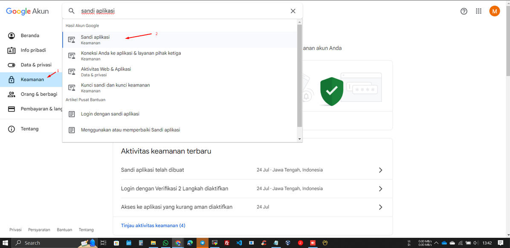

<h1> Setup </h1>
<h2>Install Docker</h2>

1. Update repos
    
    ```yaml
    apt update
    ```
    
2. Install dependency packages
    
    ```yaml
    apt install apt-transport-https ca-certificates curl software-properties-common
    ```
    
3. Add gpg keys
    
    ```yaml
    curl -fsSL https://download.docker.com/linux/ubuntu/gpg | sudo gpg --dearmor -o /usr/share/keyrings/docker-archive-keyring.gpg
    ```
    
4. Add docker repos
    
    ```yaml
    echo "deb [arch=$(dpkg --print-architecture) signed-by=/usr/share/keyrings/docker-archive-keyring.gpg] https://download.docker.com/linux/ubuntu $(lsb_release -cs) stable" | sudo tee /etc/apt/sources.list.d/docker.list > /dev/null
    ```
    
5. Update repos
    
    ```yaml
    apt update
    ```
    
6. Install Docker ce
    
    ```yaml
    apt install docker-ce -y
    ```
    
7. Start service
    
    ```yaml
    service docker start
    ```

<h2>Install Sentry Self-hosted</h2>
<b>This is from official docs sentry self-hosted</b>

1. Run Installation
    
    ```yaml
    git clone https://github.com/getsentry/self-hosted
    ```

2. Run Installation
    
    ```yaml
    ./install.sh
    ```
    
3. Create sentry user manually
    
    ```yaml
    sentry createuser
    ```

<h1>Setup SMTP Gmail</h1>
<h2>Generate App Password For</h2>

<h2>Config SMTP, Base URL, and CSRF Token ABOVE</h2>
